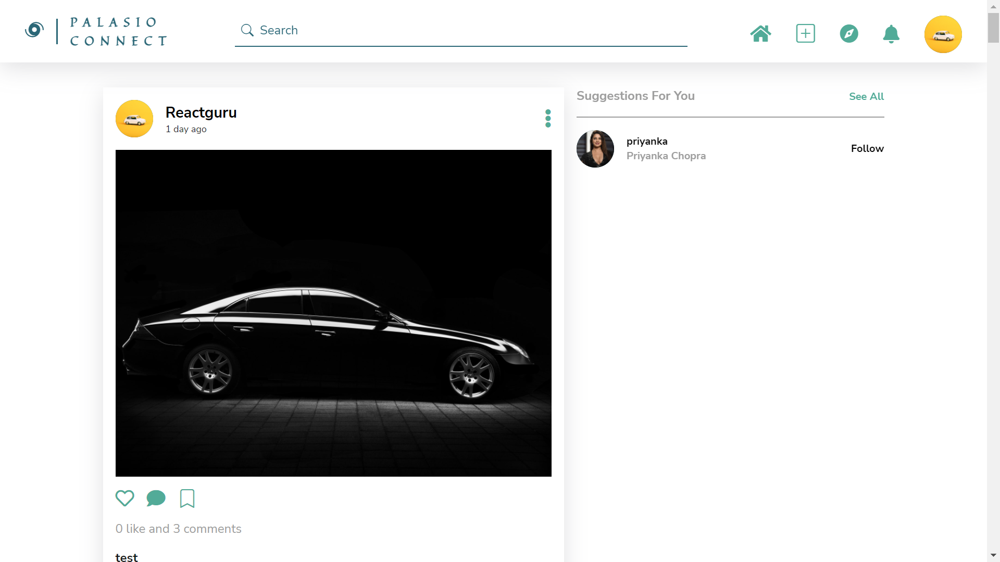

# Palasio Connect

Palasio Connect is great for meeting new people, making friends and sharing interests.

---

## Tech Stack

**Client:** React, React Router, Redux Toolkit

**Server:** Node, Express, MongoDB, Mongoose, Cloudinary

**Authentication:** JWT, Password Encryption with Bcrypt

## Functionalities

- Posts
- Add images with captions
- Edit password
- Delete account
- Add avatar image
- Follow/unfollow others
- Edit profile
- Delete posts

## Screenshots

## 🌐 Demo

Have a look at the live demo of [Palasio Connect](https://palasio-connect.netlify.app/).

## 🚀 About Me

I'm a full stack developer (MERN). I have always been fascinated by technologies and how they have made our lives better. So learning and exploring new things have always made me happier.

## 🔗 Links

---